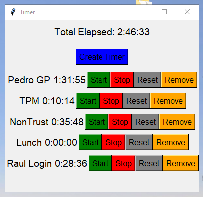

# TimeTracker
A simple tkinter-based set of Timer Apps with multiple timers, custom labels, and timer removal functionality. This application allows you to create multiple timers, start, stop, and reset them individually, and displays the total elapsed time across all timers.


## Features
- Create multiple timers with custom labels.
- Start, stop, and reset timers individually.
- Remove individual timers.
- Displays the total elapsed time across all timers.

## Usage
To use this Timer App, follow these steps:

1. Make sure you have Python 3.x installed on your system. You can download it from Python's official website.
1. Ensure that the tkinter library is installed. It should be installed by default with Python 3.x.
1. Save the Timer App code to a .py file on your computer (e.g., timer_app.py).
1. Open a terminal (Linux/macOS) or command prompt (Windows), navigate to the directory containing the .py file, and run the following command:
    ```bash
    python3 stopwatch3.py
    ```

1. The Timer App window will open. Click "Create Timer" to create a new timer with a custom label. If you don't provide a custom label, it will default to "Timer1", "Timer2", and so on.
1. Use the Start, Stop, Reset, and Remove buttons to control each timer.

# Code Description

Importing libraries: We start by importing the required libraries, tkinter for creating the GUI and timedelta for formatting time.

```python
import tkinter as tk
from datetime import timedelta
```

- ```TimerWidget``` class: This class represents an individual timer, including its label, time, buttons, and associated functions. Each instance of this class is a single timer widget.

    - ```__init__``` method: Initializes the timer widget, setting up the layout, buttons, and their associated functions.
    - ```update_time``` method: Updates the timer's time, incrementing by one second and updating the display if the timer is running.
    - ```format_time``` method: Formats the time as a string using timedelta.
    - ```start```, ```stop```, and ```reset``` methods: Control the timer's behavior, starting, stopping, or resetting it.
    - ```remove``` method: Removes the timer widget from the application.


- ```TimerApp``` class: This class represents the main application window, handling the creation and management of TimerWidget instances and the total elapsed time display.

    - ```__init__``` method: Initializes the main window, creating and displaying the "Total Elapsed" label and the "Create Timer" button.
    - ```open_label_window``` method: Opens a pop-up window for the user to enter a custom label for a new timer.
    - ```create_timer``` method: Creates a new TimerWidget instance with the specified or default label, adds it to the main window, and updates the total elapsed time.
    - ```update_total_elapsed``` method: Updates and displays the total elapsed time across all timers. This method is called every second using self.master.after(1000, self.update_total_elapsed).


- Main section: The ```if __name__ == "__main__"```: section sets up the main application window, creates an instance of the ```TimerApp``` class, and starts the ```tkinter``` main event loop.

## Here's a step-by-step explanation of the flow of the program:

1. When the program starts, it creates the main application window, sets its title, and initializes the ```TimerApp``` class.
1. ```TimerApp``` sets up the "Total Elapsed" label and "Create Timer" button, which is used to create new timer widgets.
1. When the user clicks the "Create Timer" button, ```open_label_window``` is called to open a pop-up window for entering a custom label for the new timer.
1. After the user enters a label and clicks "Submit", the ```create_timer``` method is called, creating a new ```TimerWidget``` instance with the specified or default label and adding it to the main window.
1. The user can interact with each timer using its Start, Stop, Reset, and Remove buttons.
1. The ```update_total_elapsed``` method is called every second, updating and displaying the total elapsed time across all timers.
1. The program continues to run and handle user interactions until the main window is closed, at which point the ```tkinter``` main event loop is terminated.

ScreenShot:

A screenshot displaying multiple timers with labels and a combined total elapsed time. This screenshot is using ```stopwatch3.py```

